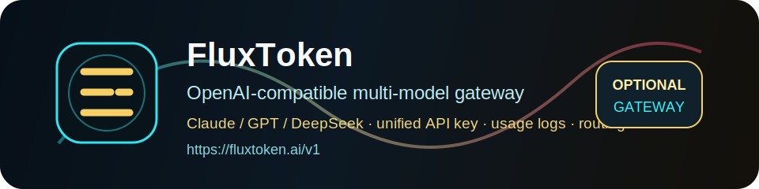

<div align="center">


# Shefu Divination

### 赛博东方风格的射覆占卜网页应用

[](LICENSE)
[](package.json)
[](https://github.com/RedStringAI/shefu-divination/actions/workflows/ci.yml)
[](#ai-配置)
[](index.html)

### 官方仓库：**[github.com/RedStringAI/shefu-divination](https://github.com/RedStringAI/shefu-divination)**

[English](README_EN.md) | 中文 | [日本語](README_JA.md) | [Deutsch](README_DE.md) | [FluxToken](https://fluxtoken.ai)

</div>

## 赞助 / 推荐网关

<details open>
<summary>推荐的 OpenAI-compatible 多模型网关</summary>

[](https://fluxtoken.ai)

<table>
<tr>
<td width="180"><strong>FluxToken</strong><br><a href="https://fluxtoken.ai">fluxtoken.ai</a></td>
<td>
Shefu Divination 的 AI 猜物能力不绑定任何一家模型服务，只要是 OpenAI-compatible endpoint 都能接。如果你想在 Claude / GPT / DeepSeek 等模型之间切换，可以使用 <a href="https://fluxtoken.ai">FluxToken</a>。FluxToken 提供统一 API Key、余额管理、使用日志和渠道路由。
<br><br>
配置方式很简单：在页面的 <code>AI 猜物设置</code> 中把接口地址填为 <code>https://fluxtoken.ai/v1</code>，再填入你的 FluxToken API Key 和模型名即可。本项目仍然保持开源和中立，也可以接 OpenAI、OpenRouter、自建 New API、本地模型服务或任何兼容网关。
</td>
</tr>
</table>

</details>

## Shefu Divination 是什么

Shefu Divination 是一个静态网页应用，用梅花易数、八卦类象和五行体用生克来推演“覆藏之物”。它可以通过时间、数字、文字三种方式起卦，多卦合参后输出候选物品、形色质性、推理链，并支持本地回测记录。

- **三路起卦**：支持天时、报数、报字，填几项就起几卦。
- **多卦合参**：把多个输入来源交叉验证，收敛到具体物品。
- **可解释推演**：展示本卦、变卦、用卦主象、五行属性和推理过程。
- **AI 猜物**：可选接入 DeepSeek、Claude、GPT 或其他 OpenAI-compatible 模型网关。
- **本地回测**：记录真实物品、命中情况和加权命中率。
- **单文件分发**：可构建成 `射覆占卜.html`，方便离线打开。
- **MIT 开源**：便于审计、扩展、自托管和二次开发。

## 预览


## 快速开始

直接打开：

```text
index.html
```

或使用任意静态服务器：

```bash
python -m http.server 8080
```

然后访问：

```text
http://127.0.0.1:8080
```

## AI 配置

AI 猜物默认关闭。展开页面里的 `AI 猜物设置`，填写：

| 配置项 | 示例 |
|---|---|
| API Key | `ft-your-key` |
| 接口地址 | `https://fluxtoken.ai/v1` |
| 模型 | `gpt-4o-mini`、`deepseek-chat` 或其他兼容模型 |

接口需要兼容 OpenAI `chat/completions` 格式。密钥只保存在当前浏览器的 `localStorage`，不会写入分发文件。

## 构建单文件

项目包含一个零依赖打包脚本，会把 CSS、数据和 JS 合并成单个 HTML 文件：

```bash
npm run build
```

生成文件：

```text
射覆占卜.html
```

## 项目结构

```text
.
├── index.html
├── assets/
│   ├── fluxtoken-banner.svg
│   └── shefu-logo.svg
├── css/
│   └── style.css
├── data/
│   └── bagua.js
├── docs/
│   └── preview.png
├── js/
│   ├── ai.js
│   ├── app.js
│   ├── cnchar.min.js
│   ├── duangua.js
│   └── qigua.js
├── build.mjs
└── 射覆占卜.html
```

## 隐私说明

- 默认易学推演不需要联网。
- API Key 只保存在当前浏览器的 `localStorage`。
- 回测记录也只保存在当前浏览器的 `localStorage`。
- 启用 AI 猜物后，请求会发送到你配置的模型接口。
- 公开演示或录屏前，建议隐藏或清空 AI Key 输入框。

## 说明

射覆、梅花易数和八卦类象属于传统文化与娱乐体验范畴，结果不可作为现实决策依据。建议使用回测功能观察命中率，而不是把结果当作确定结论。

## 开发

```bash
npm run build
```

## 许可证

Shefu Divination 使用 MIT License 开源，见 [LICENSE](LICENSE)。
