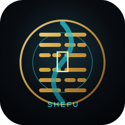
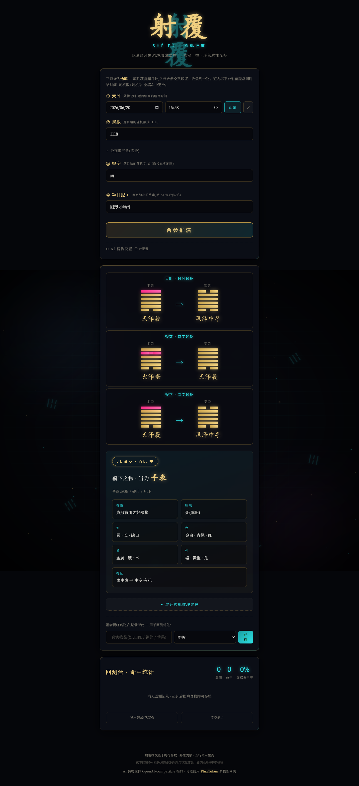

<div align="center">



# Shefu Divination

### A cyber-oriental Shefu divination web app

[](LICENSE)
[](package.json)
[](https://github.com/RedStringAI/shefu-divination/actions/workflows/ci.yml)
[](#ai-configuration)
[](index.html)

### Official Repository: **[github.com/RedStringAI/shefu-divination](https://github.com/RedStringAI/shefu-divination)**

English | [中文](README.md) | [日本語](README_JA.md) | [Deutsch](README_DE.md) | [FluxToken](https://fluxtoken.ai)

</div>

## Sponsor

<details open>
<summary>Recommended OpenAI-compatible multi-model gateway</summary>

[](https://fluxtoken.ai)

Shefu Divination is provider-neutral. Its optional AI guessing feature works with any OpenAI-compatible endpoint. [FluxToken](https://fluxtoken.ai) is a convenient multi-model gateway for Claude, GPT, DeepSeek, and other mainstream models, with unified API keys, balance management, usage logs, and routing.

Use `https://fluxtoken.ai/v1` as the base URL in the in-page AI settings, then enter your FluxToken API key and model name.

</details>

## What It Is

Shefu Divination is a static web app for guessing a hidden object through Meihua Yishu, bagua symbolism, and five-element relationships. It supports time, number, and character-based casting, then combines multiple readings into a concrete object guess with attributes, reasoning, and local backtesting.

## Features

- Time, number, and character casting.
- Multi-reading synthesis for a narrower object guess.
- Explainable output with hexagrams, attributes, and reasoning.
- Optional OpenAI-compatible AI guessing.
- Local backtesting with hit-rate tracking.
- Single-file build for offline sharing.

## Preview



## Quick Start

Open `index.html` directly, or serve the folder:

```bash
python -m http.server 8080
```

Then visit:

```text
http://127.0.0.1:8080
```

## AI Configuration

AI guessing is off by default. Open `AI settings` in the page and fill:

| Field | Example |
|---|---|
| API Key | `ft-your-key` |
| Base URL | `https://fluxtoken.ai/v1` |
| Model | `gpt-4o-mini`, `deepseek-chat`, or another compatible model |

The endpoint must support OpenAI `chat/completions`.

## Build

```bash
npm run build
```

This generates:

```text
射覆占卜.html
```

## Privacy

- The default divination engine does not require network access.
- API keys are stored only in browser `localStorage`.
- Backtesting records are stored only in browser `localStorage`.
- When AI guessing is enabled, requests are sent to the model endpoint you configure.

## License

Shefu Divination is released under the MIT License. See [LICENSE](LICENSE).

